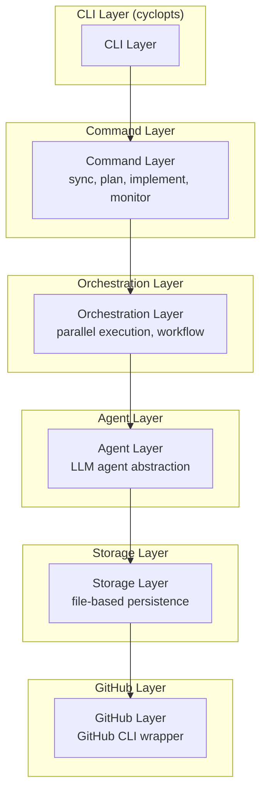
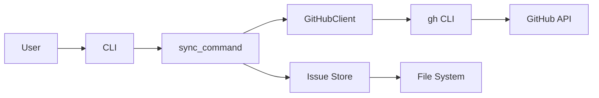
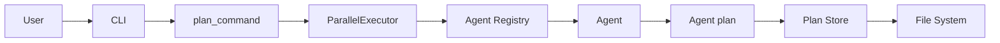
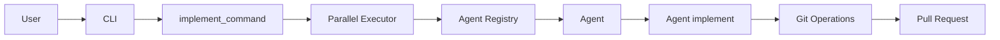

# Architecture

This document provides a technical overview of gh-worker's architecture, design decisions, and implementation details.

## Overview

gh-worker is designed as a modular, layered system with clear separation of concerns:



## Core Components

### CLI Layer

**Location**: [src/gh_worker/cli.py](../src/gh_worker/cli.py)

**Responsibilities**:

- Command-line argument parsing
- Command routing
- Logging setup

**Technology**: [cyclopts](https://github.com/BrianPugh/cyclopts)

**Design Decisions**:

- Uses cyclopts for clean, type-safe CLI definitions
- Commands are defined as functions with type annotations
- Lazy imports for faster startup

**Example**:

```python
@app.command
def plan(
    repo: str | None = None,
    issue_numbers: list[int] | None = None,
    parallelism: int | None = None,
    config_path: Path | None = None,
) -> None:
    """Generate implementation plans for issues."""
    from gh_worker.commands.plan import plan_command
    plan_command(repo, issue_numbers, parallelism, config_path)
```

### Command Layer

**Location**: [src/gh_worker/commands/](../src/gh_worker/commands/)

**Modules**:

- `config.py` - Configuration management
- `add.py` - Repository addition
- `sync.py` - Issue synchronization
- `plan.py` - Plan generation
- `implement.py` - Plan implementation
- `monitor.py` - Session monitoring
- `work.py` - Full workflow orchestration

**Responsibilities**:

- Business logic for each command
- Coordination between layers
- Error handling and logging

**Design Patterns**:

- Command pattern for each CLI command
- Dependency injection for configuration
- Async/await for I/O operations

### Agent Layer

**Location**: [src/gh_worker/agents/](../src/gh_worker/agents/)

**Modules**:

- `base.py` - Abstract base class and interfaces
- `registry.py` - Agent registry and factory
- `claude_code.py` - Claude Code implementation
- `session.py` - Session management
- `opencode.py`, `gemini.py`, `codex.py` - Placeholder implementations

**Responsibilities**:

- Abstract interface for LLM agents
- Agent lifecycle management
- Event streaming
- Session tracking

**Key Classes**:

#### `BaseAgent`

Abstract base class defining the agent interface:

```python
class BaseAgent(ABC):
    @abstractmethod
    async def plan(self, issue_content: str, repository_path: str, issue_number: int) -> AgentResult:
        pass

    @abstractmethod
    async def implement(...) -> AsyncIterator[AgentEvent]:
        pass

    @abstractmethod
    async def monitor(self, session_id: str) -> AsyncIterator[AgentEvent]:
        pass
```

#### `AgentRegistry`

Manages agent registration and instantiation:

```python
class AgentRegistry:
    def register(self, name: str, agent_class: type[BaseAgent], default: bool = False):
        pass

    def get(self, name: str | None = None, config: dict[str, Any] | None = None) -> BaseAgent:
        pass
```

**Design Patterns**:

- Registry pattern for agent management
- Factory pattern for agent creation
- Strategy pattern for agent selection
- Observer pattern for event streaming

### Storage Layer

**Location**: [src/gh_worker/storage/](../src/gh_worker/storage/)

**Modules**:

- `issue_store.py` - Issue persistence
- `plan_store.py` - Plan persistence

**Responsibilities**:

- File-based data persistence
- Directory structure management
- Timestamp tracking
- Metadata management

**File Structure**:

```
issues-path/
└── owner/
    └── repo/
        ├── .updated-at          # Repository last sync timestamp
        └── 42/                  # Issue number
            ├── description.md   # Issue content
            ├── .updated-at      # Issue last sync timestamp
            ├── plan-<timestamp>.md    # Implementation plan
            └── .plan-<timestamp>.yaml # Plan metadata
```

**Design Decisions**:

- File-based storage for simplicity and transparency
- Markdown for human-readable content
- YAML for structured metadata
- Timestamps for change tracking

### GitHub Layer

**Location**: [src/gh_worker/github/](../src/gh_worker/github/)

**Modules**:

- `client.py` - GitHub CLI wrapper

**Responsibilities**:

- GitHub API interaction via gh CLI
- Repository cloning and management
- Issue fetching
- Pull request creation

**Design Decisions**:

- Uses GitHub CLI instead of API directly
- Leverages existing authentication
- Subprocess-based for reliability

**Example**:

```python
class GitHubClient:
    async def get_issue(self, repo: str, issue_number: int) -> dict:
        """Fetch issue using gh CLI."""
        cmd = ["gh", "issue", "view", str(issue_number), "--repo", repo, "--json", "..."]
        # Execute and parse JSON
        pass
```

### Execution Layer

**Location**: [src/gh_worker/executor/](../src/gh_worker/executor/)

**Modules**:

- `parallel.py` - Parallel execution
- `orchestrator.py` - Workflow orchestration

**Responsibilities**:

- Concurrent task execution
- Resource management
- Progress tracking
- Error aggregation

**Key Features**:

- Configurable parallelism
- Graceful error handling
- Progress reporting
- Resource limits

**Example**:

```python
class ParallelExecutor:
    async def execute(
        self,
        tasks: list[Callable],
        parallelism: int = 1,
    ) -> list[Result]:
        """Execute tasks in parallel with given parallelism."""
        # Semaphore-based concurrency control
        pass
```

### Configuration Layer

**Location**: [src/gh_worker/config/](../src/gh_worker/config/)

**Modules**:

- `schema.py` - Pydantic models for configuration
- `manager.py` - Configuration file management

**Responsibilities**:

- Configuration validation
- File I/O for config
- Default values
- Type safety

**Schema**:

```python
class AppConfig(BaseModel):
    issues_path: Path | None
    repository_path: Path | None
    plan: PlanConfig
    implement: ImplementConfig
    sync: SyncConfig
    agent: AgentConfig
```

**Design Decisions**:

- Pydantic for validation and type safety
- YAML for human-friendly config files
- XDG Base Directory Specification compliance
- Immutable config objects

### Models Layer

**Location**: [src/gh_worker/models/](../src/gh_worker/models/)

**Modules**:

- `issue.py` - Issue data models
- `plan.py` - Plan data models
- `repository.py` - Repository data models

**Responsibilities**:

- Data structure definitions
- Validation
- Serialization/deserialization

**Example**:

```python
class Issue(BaseModel):
    number: int
    title: str
    body: str
    state: str
    labels: list[str]
    created_at: datetime
    updated_at: datetime
```

### Utilities

**Location**: [src/gh_worker/utils/](../src/gh_worker/utils/)

**Modules**:

- `logging.py` - Structured logging setup
- `time.py` - Time parsing and formatting
- `paths.py` - Path manipulation
- `retry.py` - Retry logic with exponential backoff

**Responsibilities**:

- Cross-cutting concerns
- Reusable utilities
- Common patterns

## Data Flow

### Sync Flow



1. User invokes `ghw issues sync`
1. CLI parses arguments and calls `sync_command`
1. `sync_command` uses `GitHubClient` to fetch issues
1. `GitHubClient` executes `gh` CLI commands
1. Issues are parsed and stored via `IssueStore`
1. Issue files written to disk

### Plan Flow



1. User invokes `ghw issues plan`
1. CLI calls `plan_command`
1. `plan_command` creates tasks for each issue
1. `ParallelExecutor` runs tasks concurrently
1. Each task gets an agent from `AgentRegistry`
1. Agent generates plan
1. Plan stored via `PlanStore`

### Implement Flow



1. User invokes `ghw issues implement`
1. CLI calls `implement_command`
1. `implement_command` creates tasks for each issue
1. `ParallelExecutor` runs tasks concurrently
1. Each task gets an agent from `AgentRegistry`
1. Agent implements the plan (writes code, runs tests)
1. Agent creates branch, commits, pushes
1. Agent creates pull request via GitHub

## Design Principles

### Modularity

Each layer has a single responsibility and minimal coupling to other layers.

### Type Safety

Extensive use of Python type hints and Pydantic models for validation.

### Async/Await

Async operations throughout for efficient I/O and concurrency.

### Configuration

Centralized configuration with validation and type safety.

### Error Handling

Comprehensive error handling with structured logging and retry logic.

### Extensibility

Plugin architecture for agents allows easy addition of new LLM providers.

### Transparency

File-based storage makes all data visible and debuggable.

### Testability

Clear interfaces and dependency injection enable comprehensive testing.

## Concurrency Model

### Parallelism

gh-worker uses Python's `asyncio` for concurrent execution:

- **Planning**: Multiple issues planned concurrently
- **Implementation**: Multiple issues implemented concurrently
- **Sync**: Issues fetched concurrently

### Semaphores

Parallelism controlled via asyncio semaphores:

```python
async def execute_with_limit(tasks, limit):
    semaphore = asyncio.Semaphore(limit)

    async def limited_task(task):
        async with semaphore:
            return await task()

    return await asyncio.gather(*[limited_task(t) for t in tasks])
```

### Resource Management

- Configurable limits prevent resource exhaustion
- Graceful degradation on errors
- Proper cleanup in all cases

## Error Handling Strategy

### Retry Logic

Automatic retry with exponential backoff for transient failures:

```python
@retry(max_attempts=3, backoff_factor=2.0)
async def fetch_issue(repo: str, number: int):
    # May fail due to network issues
    pass
```

### Error Propagation

Errors are propagated with context:

```python
try:
    result = await agent.plan(...)
except Exception as e:
    logger.error("plan_failed", repo=repo, issue=issue_number, error=str(e))
    raise PlanError(f"Failed to plan issue {issue_number}") from e
```

### Structured Logging

All errors logged with structured context:

```python
logger.error(
    "implementation_failed",
    repo=repo,
    issue=issue_number,
    error=str(error),
    session_id=session_id
)
```

## Performance Considerations

### Lazy Loading

Commands lazily import dependencies for fast startup.

### Parallel Execution

Configurable parallelism maximizes throughput.

### Caching

Issue sync timestamps prevent redundant API calls.

### Streaming

Agent output streamed for responsive UX.

## Security Considerations

### Credentials

- Uses GitHub CLI authentication (no credential storage)
- Agent API keys managed externally

### Input Validation

- All inputs validated via Pydantic
- Path traversal prevention
- Safe subprocess execution

### Code Execution

- Agents run in repository context (sandboxing recommended)
- Generated code should be reviewed before merging

## Testing Strategy

### Unit Tests

Test individual components in isolation:

```python
def test_agent_registry():
    registry = AgentRegistry()
    assert "claude-code" in registry.list_agents()
```

### Integration Tests

Test component interactions:

```python
async def test_plan_command():
    # Test full plan workflow
    pass
```

### Test Structure

```
tests/
├── unit/
│   ├── test_agents.py
│   ├── test_storage.py
│   └── test_config.py
└── integration/
    ├── test_sync.py
    ├── test_plan.py
    └── test_implement.py
```

## Dependencies

### Core Dependencies

- **cyclopts**: CLI framework
- **pydantic**: Data validation and settings
- **structlog**: Structured logging
- **pyyaml**: Configuration file parsing
- **anthropic**: Claude Code SDK (for Claude Code agent)

### Development Dependencies

- **pytest**: Testing framework
- **pytest-asyncio**: Async test support
- **ruff**: Linting and formatting
- **mkdocs**: Documentation

## Future Enhancements

### Planned Features

- Additional agent implementations
- Database backend option (alongside file storage)
- Web UI for monitoring
- Webhooks for event-driven workflows
- Metrics and analytics
- Multi-repository batching
- Template system for plans
- Agent performance profiling

### Architectural Improvements

- Plugin system for custom commands
- Event bus for loose coupling
- Background job queue
- Distributed execution support

## Next Steps

- [Agents](agents.md) - Deep dive into agent system
- [Usage Guide](usage.md) - Learn command usage
- [Configuration](configuration.md) - Configuration reference
