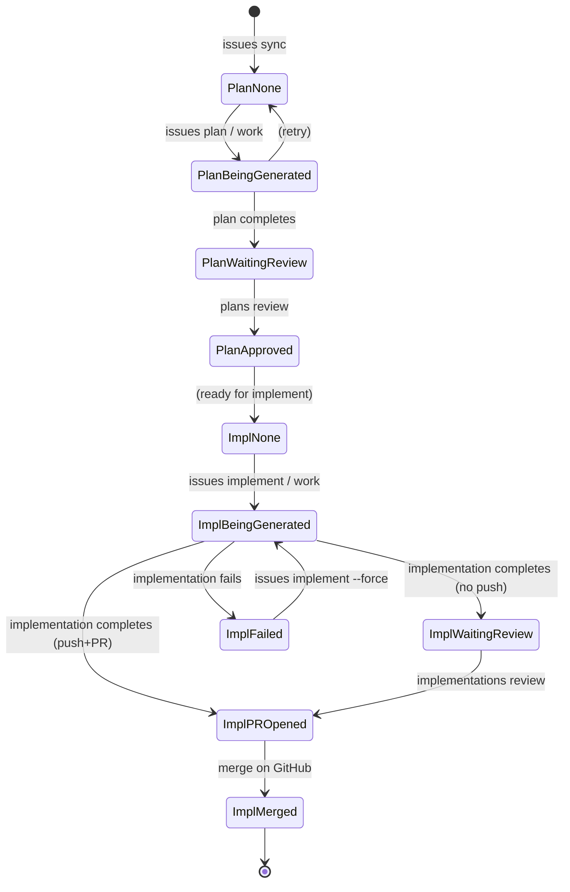

# gh-worker CLI User State Diagram

This document describes the transitions a user goes through while using the gh-worker CLI, including both the setup workflow and the issue lifecycle.

## Mermaid: Issue Lifecycle (Plan + Implementation)



## 1. Setup & Configuration Flow

```
┌─────────────┐     init      ┌──────────────┐    repositories add    ┌─────────────────┐
│ Uninitialized│──────────────▶│  Configured   │─────────────────────▶│ Repos Tracked   │
└─────────────┘               └──────────────┘                       └────────┬────────┘
                     config                                                  │
                     (optional)                                              │ issues sync
                                                                            ▼
┌─────────────┐     config     ┌──────────────┐                       ┌─────────────────┐
│   Any state  │◀──────────────▶│  Configured   │                       │ Issues Synced   │
└─────────────┘               └──────────────┘                       └────────┬────────┘
                                                                             │
                                                                             │ issues list
                                                                             │ (inspect)
                                                                             ▼
                                                                      ┌─────────────────┐
                                                                      │  Ready to Plan   │
                                                                      └─────────────────┘
```

## 2. Issue Lifecycle (Plan & Implementation States)

Each synced issue progresses through plan and implementation states. The user invokes commands that trigger transitions.

### Plan States

| State | Description | User Action to Enter | Next State |
|-------|-------------|----------------------|------------|
| **none** | No plan exists | (initial after sync) | being generated |
| **being generated** | LLM is creating plan | `issues plan` or `work` | waiting for local review |
| **waiting for local review** | Plan file exists, needs approval | (automatic when plan completes) | approved |
| **approved** | User approved plan | `plans approve` | — |

### Implementation States

| State | Description | User Action to Enter | Next State |
|-------|-------------|----------------------|------------|
| **none** | No implementation | (initial) | being generated |
| **being generated** | LLM is implementing | `issues implement` or `work` | waiting for local review / PR opened / failed |
| **waiting for local review** | Code done locally, no PR yet | (automatic when implementation completes without push) | PR opened |
| **PR opened** | Branch pushed, PR created | `implementations review` or auto from implement | merged |
| **merged** | PR merged to main | (external: merge on GitHub) | — |
| **failed** | Implementation failed | (automatic on error) | — |

### State Diagram (Issue Lifecycle)

```
                                    PLAN PHASE
┌──────────┐   issues plan    ┌──────────────────┐   plan completes   ┌─────────────────────────┐
│  none    │─────────────────▶│ being generated  │──────────────────▶│ waiting for local review │
└──────────┘   or work        └──────────────────┘                   └───────────┬─────────────┘
                                                                                   │
                                                                   plans review   │
                                                                                   ▼
                                                                            ┌──────────┐
                                                                            │ approved │
                                                                            └─────┬────┘
                                                                                  │
                                    IMPLEMENTATION PHASE                         │
                                                                                  │
┌──────────┐   issues implement   ┌──────────────────┐   implementation completes   ┌──────┴──────────────────┐
│  none    │◀─────────────────────│ being generated  │──────────────────▶│ waiting for local review│
└──────────┘   or work (approved) └────────┬─────────┘   (no push)        └───────────┬──────────────┘
       ▲                                   │                                                         │
       │                                   │ implementation fails                                               │
       │                                   ▼                                                          │
       │                            ┌──────────┐                                                      │
       └────────────────────────────│  failed  │                                                      │
                                    └──────────┘                                                      │
                                                                                                      │
                                    implementations review                                      │
                                    (push + create PR)                                                │
                                                                                                      ▼
                                                                                             ┌─────────────┐
                                                                                             │ PR opened   │
                                                                                             └──────┬──────┘
                                                                                                    │
                                                                                    merge on GitHub  │
                                                                                                    ▼
                                                                                             ┌─────────────┐
                                                                                             │   merged    │
                                                                                             └─────────────┘
```

## 3. User Command Flow (Typical Workflow)

```
                    ┌─────────────────────────────────────────────────────────────────┐
                    │                     TYPICAL USER JOURNEY                          │
                    └─────────────────────────────────────────────────────────────────┘

  First-time setup:
  ─────────────────
  init  →  config  →  repositories add  →  config issues-path  →  config repository-path

  Per-issue workflow (manual):
  ────────────────────────────
  issues sync  →  issues list  →  issues plan  →  plans review  →  issues implement
                                                                              │
                    ┌─────────────────────────────────────────────────────────┘
                    │
                    ▼
  (if implement doesn't push/PR)  implementations review  →  PR opened on GitHub
                    │
                    │ (if implement pushes/PR automatically)
                    ▼
  PR opened on GitHub  →  merge on GitHub  →  merged

  Automated workflow:
  ───────────────────
  work  →  (runs sync → plan → implement in a loop; user still runs review commands for plans/implementations)
```

## 4. Monitor & Work Commands

| Command | Purpose | User State |
|---------|---------|------------|
| `monitor <repo> <issue>` | Watch LLM progress during plan or implement | User is waiting; plan/implementation **being generated** |
| `work [--once]` | Run full cycle (sync → plan → implement) | Automated; may run continuously |

## 5. Summary: All CLI Commands by Category

| Category | Commands | Transitions |
|----------|----------|-------------|
| **Setup** | `init`, `config` | Uninitialized → Configured |
| **Repos** | `repositories add`, `list`, `remove` | Configured → Repos Tracked |
| **Sync** | `issues sync` | Repos → Issues Synced |
| **Inspect** | `issues list` | View current plan/implementation state |
| **Plan** | `issues plan` | none → being generated → waiting for review |
| **Review** | `plans approve`, `plans review`, `implementations review` | waiting for review → approved / PR opened |
| **Implement** | `issues implement` | approved → being generated → waiting for review / PR opened / failed |
| **Automate** | `work` | Runs sync → plan → implement cycle |
| **Monitor** | `monitor` | Observe being generated |
