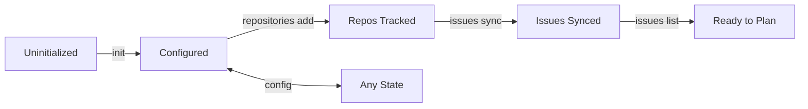
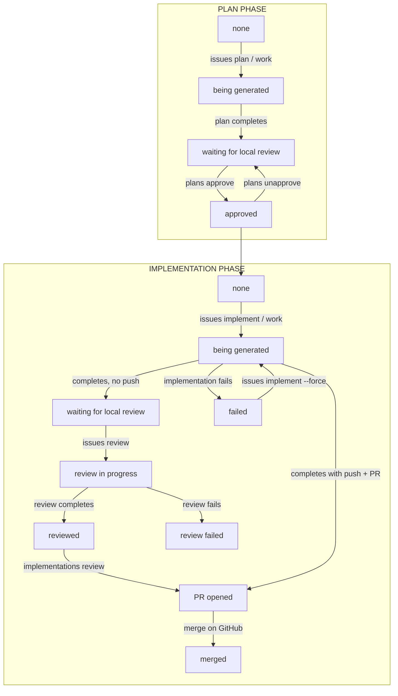
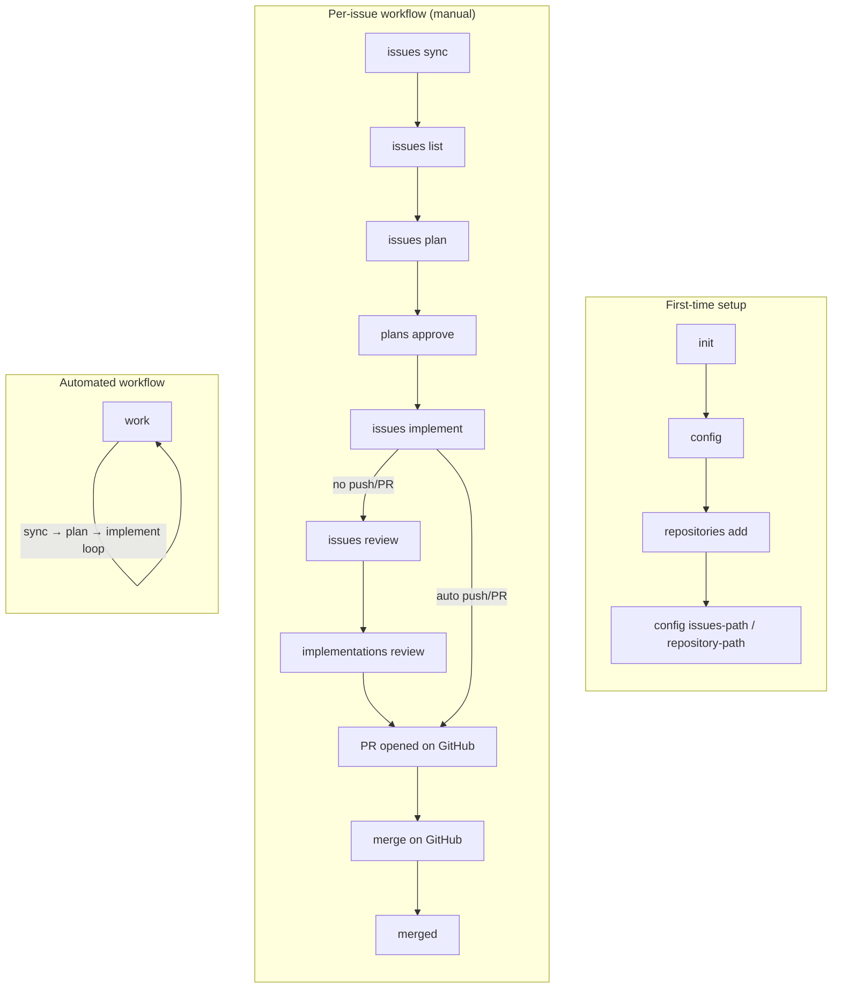

# gh-worker CLI User State Diagram

This document describes the transitions a user goes through while using the gh-worker CLI, including both the setup workflow and the issue lifecycle.

## 1. Setup & Configuration Flow

## 2. Issue Lifecycle (Plan & Implementation States)

Each synced issue progresses through plan and implementation states. The user invokes commands that trigger transitions.

### Plan States

| State | Description | User Action to Enter | Next State |
|-------|-------------|----------------------|------------|
| **none** | No plan exists | (initial after sync) | being generated |
| **being generated** | LLM is creating plan | `issues plan` or `work` | waiting for local review |
| **waiting for local review** | Plan file exists, needs approval | (automatic when plan completes) | approved |
| **approved** | User approved plan | `plans approve` | — |

### Implementation States

| State | Description | User Action to Enter | Next State |
|-------|-------------|----------------------|------------|
| **none** | No implementation | (initial) | being generated |
| **being generated** | LLM is implementing | `issues implement` or `work` | waiting for local review / PR opened / failed |
| **waiting for local review** | Code done locally, no PR yet | (automatic when implementation completes without push) | PR opened |
| **review in progress** | LLM is reviewing the implementation | `issues review` | reviewed / review failed |
| **reviewed** | Review completed | (automatic when review completes) | PR opened |
| **PR opened** | Branch pushed, PR created | `implementations review` or auto from implement | merged |
| **merged** | PR merged to main | (external: merge on GitHub) | — |
| **failed** | Implementation failed | (automatic on error) | being generated |
| **review failed** | Review failed | (automatic on error) | — |

### State Diagram (Issue Lifecycle)

## 3. User Command Flow (Typical Workflow)

## 4. Monitor & Work Commands

| Command | Purpose | User State |
|---------|---------|------------|
| `monitor <repo> <issue>` | Watch LLM progress during plan or implement | User is waiting; plan/implementation **being generated** |
| `work [--once]` | Run full cycle (sync → plan → implement) | Automated; may run continuously |

## 5. Summary: All CLI Commands by Category

| Category | Commands | Transitions |
|----------|----------|-------------|
| **Setup** | `init`, `config` | Uninitialized → Configured |
| **Repos** | `repositories add`, `list`, `remove` | Configured → Repos Tracked |
| **Sync** | `issues sync` | Repos → Issues Synced |
| **Inspect** | `issues list` | View current plan/implementation state |
| **Plan** | `issues plan` | none → being generated → waiting for review |
| **Review** | `plans review`, `plans approve`, `plans unapprove` | waiting for review ↔ approved |
| **Implement** | `issues implement` | approved → being generated → waiting for review / PR opened / failed |
| **Review Impl** | `issues review`, `implementations review` | waiting for review → reviewed → PR opened |
| **Automate** | `work` | Runs sync → plan → implement cycle |
| **Monitor** | `monitor` | Observe being generated |
